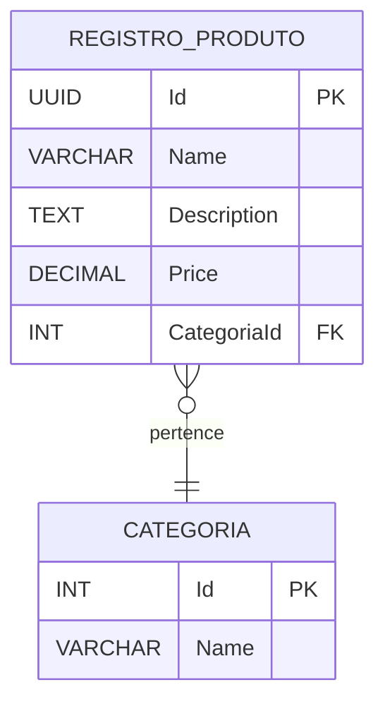
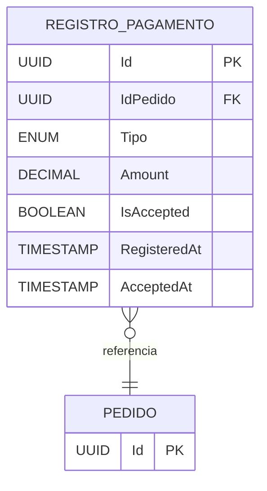
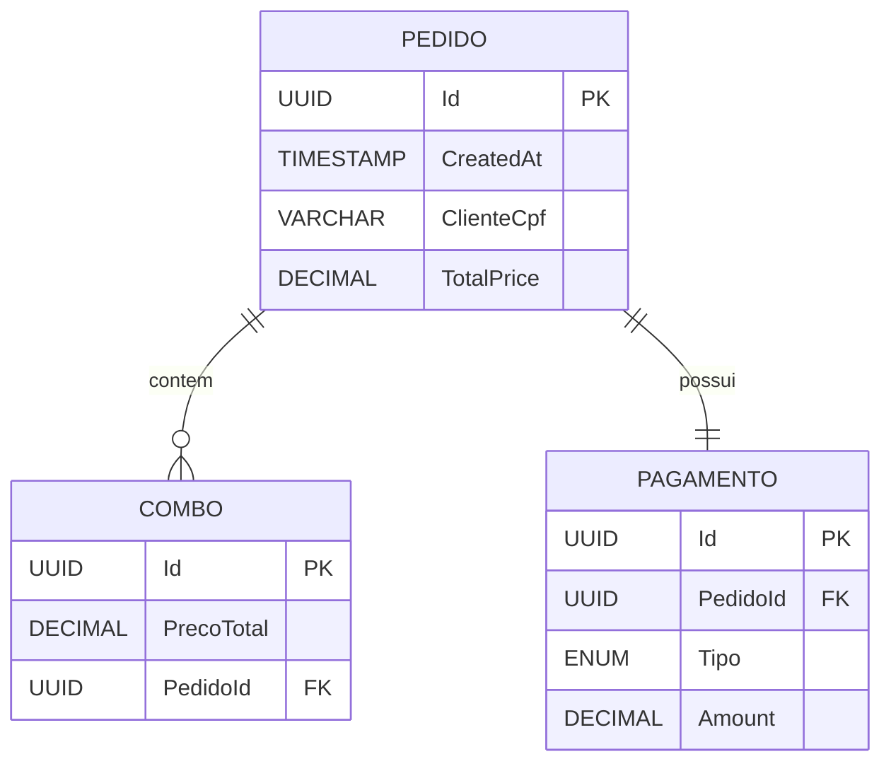
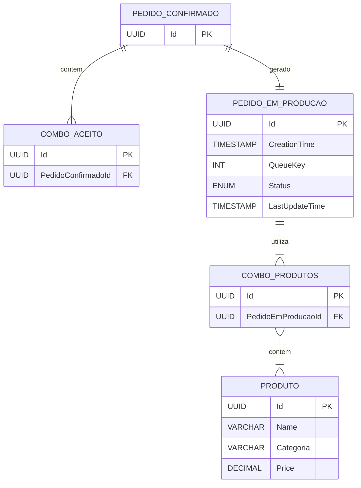

# 🗃 dotlanche-database

Repositório IaC para provisionamento de bancos de dados para os microsserviços dotlanches.  Contém as configurações de criação dos bancos de dados de cada microsserviço, bem como a criação de usuários das aplicações.

**Bancos Provisionados:**
- Mongo DB Atlas para serviço de pedido e produção.
- Postgresql AWS RDS para serviço de pagamento.
- Postgresql AWS RDS para serviço de produto.

**Ferramentas:**
- Terraform
- GitHub Actions
- MongoDB Atlas
- Postgresql
- AWS RDS

---
## Seleção dos Bancos de Dados
#### **Visão Geral do Contexto**
O projeto envolve um pequeno negócio que está crescendo, com uma demanda variável influenciada por fatores como fins de semana, feriados e férias escolares. À medida que o negócio expande, várias necessidades operacionais surgem:

- **Pedidos Personalizados**: Embora não faça parte do MVP, há uma grande possibilidade de no futuro permitir que os clientes modifiquem os pedidos (ex.: alterar ingredientes em lanches ou sobremesas).
- **Diversidade de Categorias de Produtos**: Os clientes podem fazer pedidos contendo apenas algumas categorias de produtos, como apenas sobremesas ou bebidas.
- **Serviço de Pagamento Externo**: Os pagamentos são processados por um sistema externo, ou seja, o sistema interno só precisa enviar o valor e aguardar a confirmação, sem lidar diretamente com as transações financeiras.
- **Gerenciamento de Produtos**: O sistema deve gerenciar as informações dos produtos segundo uma lista de atributos previamente definida e categorias específicas.
- **Fila de Pedidos**: O sistema deve rastrear os status dos pedidos e fornecer atualizações em tempo real.

Dado esse cenário, a escolha do banco de dados é fundamental para atender às necessidades do negócio, especialmente no que se refere à escalabilidade, flexibilidade e desempenho.

---

### **Comparação de Bancos de Dados SQL e NoSQL**

#### **1. Bancos de Dados SQL:**
Bancos de dados SQL são conhecidos por seu esquema estruturado e adesão aos princípios ACID (Atomicidade, Consistência, Isolamento e Durabilidade). Embora ofereçam muitos benefícios, sua rigidez e limitações de escalabilidade vertical os tornam menos ideais para as necessidades deste projeto.

- **Rigidez de Esquema**: Bancos de dados SQL impõem um esquema rígido que garante uniformidade e confiabilidade dos dados. Embora isso seja bom para entidades bem definidas, limita a flexibilidade quando é necessário adicionar novos atributos aos produtos (ex.: rotulagem de alérgenos ou modificações personalizadas em lanches).
- **Escalabilidade Vertical**: Bancos de dados SQL escalam principalmente de forma vertical, o que significa que aumentar a capacidade do servidor requer hardware mais caro e poderoso.
- **Consultas com SQL**: Bancos de dados SQL utilizam linguagem de consulta estruturada (SQL), o que oferece ferramentas poderosas para gerenciar dados estruturados, mas pode ser menos eficiente ao lidar com grandes volumes de tráfego ou dados não estruturados.
- **Consistência**: Bancos de dados SQL garantem um alto nível de consistência e durabilidade dos dados, o que é útil para transações financeiras, mas não é crucial para este sistema, dado que o processamento de pagamentos é feito por um serviço externo.

#### **2. Bancos de Dados NoSQL:**
Por outro lado, os bancos de dados NoSQL se destacam em cenários onde flexibilidade, desempenho e escalabilidade horizontal são fatores críticos. Essas características estão mais alinhadas com as necessidades do negócio, especialmente à medida que ele cresce e diversifica suas ofertas.

- **Desempenho e Flexibilidade**: Bancos de dados NoSQL oferecem maior desempenho de leitura e gravação durante picos de demanda, o que é essencial, considerando a variação sazonal e imprevisível da demanda. Além disso, o esquema flexível é mais adequado para lidar com diferentes categorias de produtos e para preparar o sistema para futuras funcionalidades (ex.: novos detalhes de clientes ou opções de pedidos personalizados).
- **Escalabilidade Horizontal**: Conforme o negócio se expande, os bancos de dados NoSQL podem escalar horizontalmente, adicionando mais servidores para garantir melhor desempenho durante períodos de alto tráfego, sem a necessidade de upgrades caros de hardware.
- **Dados Não Estruturados**: Como os pedidos dos clientes podem variar bastante (ex.: pedidos personalizados ou apenas de categorias específicas), a capacidade dos bancos de dados NoSQL de lidar eficientemente com dados não estruturados ou semiestruturados é uma grande vantagem.
- **Esquema Dinâmico**: A flexibilidade de esquema dos bancos de dados NoSQL permite a adição de novos campos (como atributos de produtos ou opções de pedidos personalizados) sem grandes modificações no design do banco de dados, garantindo que o sistema possa se adaptar conforme as necessidades do negócio evoluem.

---

### **Escolha de banco de dados de cada Microsserviço**

1. **Produto**:
   - Banco de dados relacional (postgreSQL) para persistência dos produtos oferecidos pelo estabelecimento e suas respectivas categorias. A definição das informações necessárias para cada produto (nome, descrição, preço e categoria) torna simples a definição de uma tabela para persistência dos registros.
   
2. **Pagamentos**:
   - Embora o serviço de pagamentos seja terceirizado, as tentativas de pagamento são registradas pelo sistema com as respectivas datas e horários, contendo o status da transação. Para esse serviço, o banco utilizado foi relacional (postgreSQL) para persistir os registros de pagamento associados com ID do pedido, timestamps da transação e status da resposta.

3. **Pedido**:
   - Dadas as necessidades de desempenho e possibilidade de escala horizontal para atender picos de acessos de clientes, o banco escolhido para o serviço de pedidos foi o não-relacional (mongoDB). Além disso, a flexibilidade de esquema facilita a persistência dos combos de pedidos, que podem ter várias combinações de categorias de produtos (todas os sub-agrupamentos das 4 categorias disponíveis).

4. **Produção**:
   - Dada a coesão entre este serviço e o de pedidos, foi usado também o banco não-relacional (mongoDB) para armazenar os pedidos com seus status de produção e consultá-los na ordem em que estão sendo preparados.
   
---

## Modelagem dos Bancos de Dados

#### Modelo de Entidade-Relacionamento (MER) para o Serviço de Produto

#### Modelo de Entidade-Relacionamento (MER) para o Serviço de Pagamento

#### Modelo de Entidade-Relacionamento (MER) para o Serviço de Pedido

#### Modelo de Entidade-Relacionamento (MER) para o Serviço de Produção

---

* **Licença:** MIT
